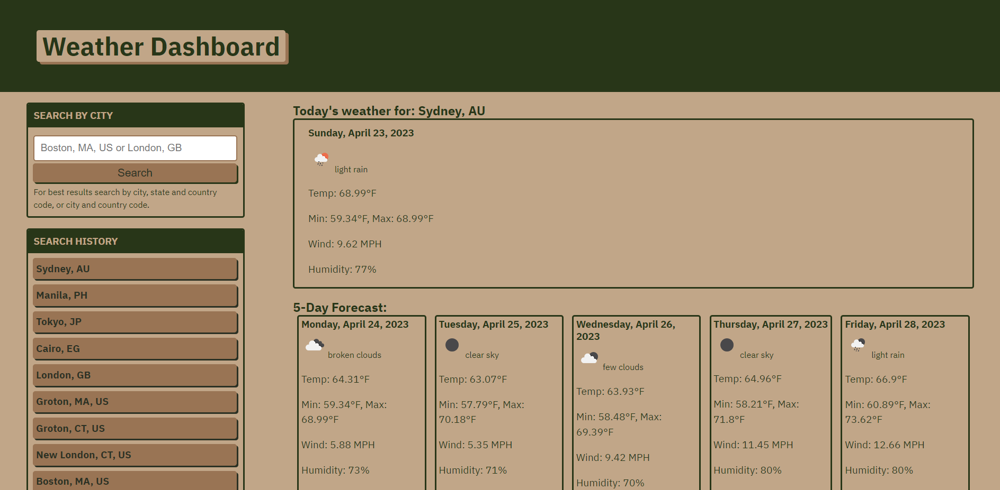

# five-day-forecast

## Description

Creating this weather app has been an incredibly valuable experience for me as a student to enhance my programming, problem-solving and critical-thinking abilities. Working with APIs to manipulate the data into UI elements is an invaluable skill and used in many web development projects.

The calendar app itself serves as a useful tool to keep track of the weather on a global scale. The tool will recognize a valid city, city, state, and country code, or just city and country code, and return the first result. For more accurate results, search by city, state and country code, or city and country code.

## Installation

No installation required, but if you want to run this locally:

### Requirements

- [Visual Studio Code](https://code.visualstudio.com/download)

- [Live Server Extension](https://marketplace.visualstudio.com/items?itemName=ritwickdey.LiveServer)

- [OpenWeatherMap API Key](https://openweathermap.org/)

## Usage

1. You will require an IDE such as Visual Studio Code. 

2. After installing Visual Studio Code, install the Live Server extension.

3. Download the project code and export it to your local machine.

4. Open the folder where index.html resides in Visual Studio Code.

5. Right-click index.html and choose "Open with Live Server".

6. Search for a city. For best results search by city, state and country code, or city and country code.

## Preview

[Link to site](https://justjenb.github.io/five-day-forecast/)

## Credits

### References

https://www.twilio.com/blog/converting-formatting-dates-timezones-javascript

https://devhints.io/wip/intl-datetime

https://developer.mozilla.org/en-US/docs/Web/JavaScript/Reference/Global_Objects/Intl/DateTimeFormat/formatToParts

https://home.openweathermap.org/

https://www.w3schools.com/tags/att_input_placeholder.asp

https://stackoverflow.com/questions/60555294/add-change-listener-on-data-attributes-for-multiple-elements

https://developer.mozilla.org/en-US/docs/Web/JavaScript/Closures

https://getbootstrap.com/docs/4.0/components/card/

https://www.w3schools.com/jsref/met_element_setattribute.asp

https://www.rgraph.net/blog/2022/using-css-vs-javascript-for-external-link-icons.html

https://www.tutorialspoint.com/how-to-clear-the-form-after-submitting-in-javascript-without-using-reset

https://stackoverflow.com/questions/6603015/check-whether-a-string-matches-a-regex-in-js

https://stackoverflow.com/questions/73723485/openweathermap-forecast-min-max-temperature-hole-day-forecast

https://stackoverflow.com/questions/46802448/how-do-i-group-items-in-an-array-by-date

https://dyclassroom.com/javascript-code/create-an-array-of-dates-between-start-date-and-end-date-in-javascript

https://forum.freecodecamp.org/t/slice-and-splice-and-foreach/210409

## License

Please refer to the LICENSE in the repo.

